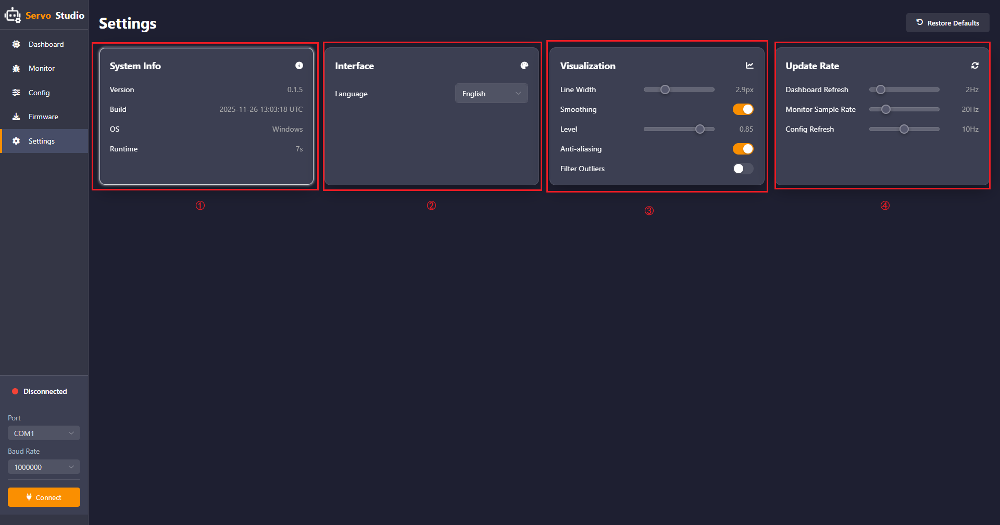

# 1. BusLinker V3.0 Servo Debugging Board User Manual

## 1.1 Introduction

The BusLinker V3.0 Servo Debugging Board is a servo debugging tool used for servo testing and parameter configuration with the ServoStudio PC software. The debugging board can also communicate with microcontrollers via serial communication to control servos. Its main features are as follows:

* Supports serial bus servo connections and is compatible with PH2.0, 5264, and 1.25T interfaces. Fully adapts to Hiwonder magnetic encoder intelligent bus servos, enabling plug-and-play connections.

- Built-in eight configurable baud rate levels, with support up to 1,000,000 bps, meeting control requirements in different applications.
- Compatible with multiple controllers. The onboard communication switching interface allows flexible switching between ESP32, STM32, Arduino, Raspberry Pi, and Jetson controllers.
- Supports multiple communication modes, including UART, USB, and single-wire TTL. Servo motion can be quickly controlled using communication commands.
- Dual power input design, providing high-current DC input and terminal block power input. Supports a wide input voltage range from 5 V to 14 V for stable and reliable operation.
- Supports secondary development. Reserved expansion serial ports and provided communication examples facilitate function expansion and further development.
- Compact size with a mini structural design, reducing space usage and improving overall robot integration flexibility.
- Compatible with the LeRobot project.

## 1.2 Interfaces and Power Supply

### 1.2.1 Interface Description

The interfaces of the BusLinker V3.0 Servo Debugging Board are shown in the table below.

<table border="1">
  <thead>
    <tr>
      <th style="text-align: center;">Index</th>
      <th style="text-align: center;">Description</th>
    </tr>
  </thead>
  <tbody>
    <tr>
      <td>① 5264 Bus Servo Port</td>
      <td>Connects bus servos for debugging</td>
    </tr>
    <tr>
      <td>② PH2.0 Bus Servo Port</td>
      <td>Connects bus servos for debugging</td>
    </tr>
    <tr>
      <td>③ 1.25T Bus Servo Port</td>
      <td>Connects bus servos for debugging</td>
    </tr>
    <tr>
      <td>④ Communication Selection Pins</td>
      <td>Switches communication mode between USB and TTL</td>
    </tr>
    <tr>
      <td>⑤ Serial Port Pins</td>
      <td>Used for serial communication with external microcontrollers</td>
    </tr>
    <tr>
      <td>⑥ DC Power Input</td>
      <td>Connects a 5.5 × 2.1 mm DC power adapter</td>
    </tr>
    <tr>
      <td>⑦ Terminal Power Port</td>
      <td>Connects a lithium battery for power supply</td>
    </tr>
    <tr>
      <td>⑧ Type-C Port</td>
      <td>Communicates with PC software or the controller</td>
    </tr>
  </tbody>
</table>

### 1.2.2 Power Supply Description

The BusLinker V3.0 board supports two power supply methods: terminal block power supply and DC connector power supply.

The supported input voltage range is 5–14 V. A 12 V 5 A power adapter or an 11.1 V lithium battery may be used for the power supply.

> [!NOTE]
> 
> **When powering the board through the terminal block, ensure that the battery polarity is connected correctly. Do not reverse the positive and negative terminals.**

## 1.3 PC Software Overview

> [!NOTE]
> 
> The servos and servo horns used in this document are for demonstration purposes only. Refer to the actual hardware in use.

### 1.3.1 Setting Up the PC Software Control Environment

#### 1.3.1.1 Hardware Wiring and Connections

The required materials are listed in the table below. Here, the HX-30HM magnetic encoder servo and an 11.1 V battery are used as examples.

<table border="1">
  <thead>
    <tr>
      <th style="text-align: center;">Item</th>
      <th style="text-align: center;">Quantity</th>
    </tr>
  </thead>
  <tbody>
    <tr>
      <td style="text-align: center;">BusLinker V3.0 Servo Debugging Board</td>
      <td style="text-align: center;">1</td>
    </tr>
    <tr>
      <td style="text-align: center;">HX-30HM</td>
      <td style="text-align: center;">1</td>
    </tr>
    <tr>
      <td style="text-align: center;">Type-C data cable</td>
      <td style="text-align: center;">1</td>
    </tr>
    <tr>
      <td style="text-align: center;">11.1V battery</td>
      <td style="text-align: center;">1</td>
    </tr>
    <tr>
      <td style="text-align: center;">Battery power cable</td>
      <td style="text-align: center;">1</td>
    </tr>
    <tr>
      <td style="text-align: center;">5264 servo connector cable</td>
      <td style="text-align: center;">1</td>
    </tr>
  </tbody>
</table>

1. Connect the servo to the BusLinker V3.0 board via the servo cable to the 5264 3-pin bus servo port.
2. Connect the red wire of the adapter cable to the **+** on the board and the black wire to **−**, then connect the USB cable.

> [!NOTE]
> 
> * **Ensure the battery polarity is correct when connecting the adapter cable. Do not reverse the positive and negative terminals.**
> * **Place the jumper cap on the Servo and USB pins.**

3. Connect the lithium battery to the battery connector cable. The cable is designed to prevent reverse insertion. Do not force it if it does not fit.
   
   If a lithium battery is not available, use a stable 12 V power supply.

#### 1.3.1.2 Software Environment Setup

* **ServoStudio Installation**

ServoStudio PC software path: [Appendix / ServoStudio_0.1.3.exe](https://drive.google.com/drive/folders/1ptj8TAkLZG6f0g-88NdwO-Hsus33CskO).

Double-click to open and use the software.

* **Serial Port Driver Installation**

CH341 serial driver installation package path: [Appendix / ch341ser.exe](https://drive.google.com/drive/folders/1ptj8TAkLZG6f0g-88NdwO-Hsus33CskO).

Installation steps:

① Double-click to open the CH341 serial driver installation package.

② Click `Install` to install the driver.

③ When a popup confirms successful installation, click **OK**.

### 1.3.2 PC Software Testing

#### 1.3.2.1 Servo Status Description

The following three images show the three basic servo positions — central position, maximum angle, and minimum angle. For visual demonstration, a servo horn is inserted as an example, with the label placed on the right-side servo arm to indicate the initial position.

Adjustable central position: servo angle 180°, corresponding position 2047

Maximum position within one rotation: servo angle 360°, corresponding position 4095

Minimum position within one rotation: servo angle 0°, corresponding position 0

#### 1.3.2.2 Reading and Configuring Servo Information

1. Open the BusLinker V3.0 board software located at [2. Softwares / Servo Debugging Board Software](https://drive.google.com/drive/folders/19xPsh_8OnDMBHe_g1RRZSTcbwcvie8lP). On the left side of the interface, select the serial port, then click the button to open the port. The default baud rate is 1,000,000, then click **Connect**.

2. After the serial port is connected, click **Scan** in the **Dashboard**. The software will scan servos with IDs from 1 to 253. The detected servos will be displayed in the interface.

3. Click **Config** to enter the parameter configuration interface. Here, the servo parameters can be viewed and configured as needed.

(1) Basic Configuration

① **General — Basic Configuration**

In this module, the servo ID and the baud rate for communication between the PC software and the servo can be changed. Servo IDs range from 1 to 253, and eight baud rate options are available.

② **Control Mode — Operation Mode**

In this module, the servo can be set to three modes: **Position**, **Velocity (Closed-Loop)**, and **PWM (Open-Loop)**.

In **Position** mode, the servo operates in servo mode. In **Velocity (Closed-Loop)** and **PWM (Open-Loop)** modes, the servo operates in motor mode.

③ **Torque — Torque Control**

This module is used to set the **Startup Torque** and the **Torque Limit**. The Startup Torque is the minimum output torque for startup, and the Torque Limit is the maximum output torque limit. Set 1000 = 100% × Stall Torque.

> [!NOTE]
> 
> **If the torque is set too low, the servo may fail to rotate.**

(2) Motion Control

① **Position Control — Position Parameters**

* **Offset — Position correction used to calibrate servo deviation.** The range is -2047 to 2047. If the servo horn cannot be installed in a cross posture due to deviation, adjust this parameter to correct the offset.
* **Min/Max Angle — Minimum and maximum angle limits** for restricting the servo rotation range. The range is -30719 to 30719. In absolute position mode, the maximum servo position range is -30719 to 30719. Position 0 to 4095 corresponds to 0° to 360°, so the maximum rotation range is approximately ±7.5 turns. The rotation range can be set within this range according to requirements.

② **Position PID — Position Closed-Loop Parameters**

Three parameters are used to adjust the servo position error: **P** determines the influence of the current position error on the control signal. **I** reduces long-term static error and normally does not need adjustment. **D** reduces the rate of change of error, improving system stability. These parameters can be adjusted according to requirements to achieve the desired performance.

③ **Velocity PID — Velocity Closed-Loop Parameters**

Two parameters are used to adjust the servo speed error, ensuring motion at the desired speed and maintaining precise speed control. These parameters can be adjusted according to requirements to achieve the desired performance.

(3) **Protection**

Thresholds for each module can be adjusted and the actions that trigger protection or alarms can be selected according to requirements.

* **Voltage** — Under Voltage and Over Voltage threshold, range 0–254, unit 0.1 V.

* **Current** — Current Max threshold, range 0–6000, unit mA. Hold is the overcurrent protection time threshold, with a range of 0–254, and a unit of 10 ms.

* **Overload** — Load Max, range 0–100, unit 1%, maximum corresponds to the maximum torque. Hold is the overload time threshold, with a range of 0–254, and a unit of 10 ms. Torque Max is the maximum output torque after triggering overload protection, with a range of 0–100, and a unit of 1%.

* **Temperature** — Over-temperature protection threshold, range 0–100, unit °C.

#### 1.3.2.3 Servo Operation Control

Click the **Monitor** option on the left to enter the servo debugging interface.

The interface consists of five areas:  
① Servo operation parameter waveform area. ② Command area for servo operation. ③ Auto Sweep area. ④ Step Mode area. ⑤ Feedback area.

The five areas are described as follows:

① Servo Operation Parameter Waveform Area

This area provides a visual display of the changes in six servo parameters during operation. On the right, switches can be enabled to display the desired parameters. Below the parameter switches, a dropdown menu allows selection of the time per division for the waveform display.

② Command Area for Servo Operation

This area allows configuration of the three servo write modes: **Write**, **SyncWrite**, and **RegWrite**. Detailed information about these write modes can be found in the [Hiwonder Magnetic Encoder Bus Servo Communication Protocol Document](https://drive.google.com/file/d/1VbDaEjqYL1_nTGah5S9nptFQBXAYzW2D/view?usp=sharing). The Torque switch controls whether the servo is powered. When the switch is turned off, the servo stops outputting torque. If a servo horn is installed, it can then be manually rotated. The slider in the middle can be used to directly control the servo position, with a range of 0–4095. Below the slider, the following parameters can be set for servo movement:  
**Accel** — acceleration, range 0–254, unit 100 steps/s².  
**Speed** — speed, range 0–3400, unit steps/s.  
**Target** — target position, range -30719 to 30719, unit steps.  
**Time** — time, range 0–1000. At the bottom, three buttons are provided:  
**As Center** sets the current target position as the central position. **Action** triggers motion in asynchronous write mode. **Apply** sends parameters to the servo in normal write and synchronous write modes**

> [!NOTE]
> 
> * **In Position mode, the Time parameter is ignored.**
> * **In Velocity (Closed-Loop) mode, only the Speed parameter is effective.**
> * **In PWM (Open-Loop) mode, only the Time parameter is effective.**

③ Auto Sweep Area

This area allows setting the **Start** and **End** positions of the servo, with a range of -30719 to 30719 in steps. **Delay** specifies the interval time between sending the **Start** and **End** positions. **Speed** is set in the Command area for servo operation. Clicking **Start** causes the servo to move back and forth between the two positions.

> [!NOTE]
> 
> **If the delay is shorter than the time required to move between the two positions, the current motion will be interrupted.**

④ Step Mode Area

In this area, the **Start** and **End** positions of the servo can be set, with a range of -4095 to 4095 in steps. **Step** specifies the step size, with a range of 0–1000 in steps. **Delay** specifies the interval time between steps. Clicking **Start** causes the servo to move from the **Start** to the **End** position according to the specified **Step** and **Delay** values.

⑤ Feedback Area

This area provides a visual display of the servo status and all relevant parameters during operation.

#### 1.3.2.4 Magnetic Encoder Servo Firmware Flashing

> [!NOTE]
> 
> **HX-30HM is used as the example in this section.**

Complete the hardware connections as described in the [1.3.1.1 Hardware Wiring and Connections](#anther3.1.1) section.

Click **Firmware**, then click **Click or drag firmware file here**.

Select the firmware file **HX-30HM_V3.9_20251023.sfw**, then click **Open**.

Click **Force Update**, then click **Update**.

When the interface shown below appears, the firmware update process has started. At this time, unplug and reconnect the servo cable.

When the content highlighted in red appears, the servo firmware update is complete.

> [!NOTE]
> 
> **If a handshake failure message appears, as shown below, follow the steps above to retry the process, click Update, and perform the firmware update again.**

#### 1.3.2.5 Software System Settings

Click **Settings** in the left panel to enter the software system settings interface.

Four module areas are available, including System Info, Interface, Visualization, and Update Rate.

① System Info:

The system information section displays the software version, creation time, operating system, and runtime duration.

② Interface:

The interface settings section allows switching the software language between English and Chinese.

③ Visualization:

Line Width: Adjusts the line thickness of the servo parameter waveform displayed in the servo debugging interface.

Smoothing: Reduces short-term fluctuations, noise, or randomness in the data.

Level: Adjusts the smoothing factor using the slider. A smaller value results in slower and more stable data changes with stronger noise resistance. A larger value results in faster and more responsive data changes with weaker noise resistance.

Filter Outliers: Detects abnormal values in the waveform.

④ Update Rate:

Adjusts the update frequency of Dashboard Refresh, Monitor Sample Rate, and Config Refresh.

## 1.4 Specifications

* **Dimensions:**

* **Other Specifications:**

| **Product**| **BusLinker V3.0 Servo Debugging Board**|
|:----------:|:----------:|
| **Brand**| **Hiwonder**|
| **Weight**| **10g**|
| **Size**| **42 x 33 x 15 mm**|
| **Communication methods**| **Serial communication**|
| **Input voltage**| **5-14V**|
| **Power input**| **1 × DC power connector, 1 × terminal block**|
| **Communication interface**| **1 × USB serial, 1 × TTL serial**|
| **Response element**| **3 × LED**|
| **Control method**| **PC software**|
| **Mounting hole distance**| **36 x 28 mm**|
| **External microcontroller**| **Supports**|

